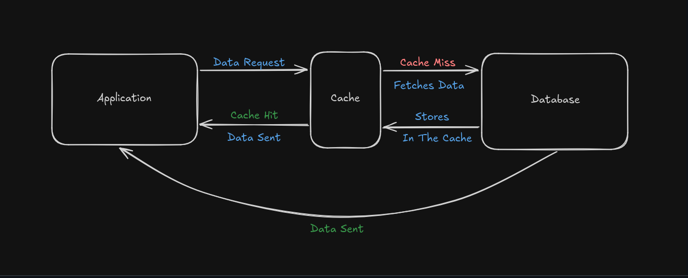
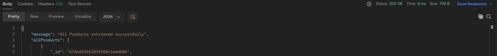

# Introduction

This is my solution for the **imagined** backend internship assignment. The main goal of this assignment is to create a robust API Server for an E-Commerce application.

# Tech Stack

This assignment solution uses **NodeJS**, **ExpressJS** and **MongoDB** for designing and developing the backend API server. Addionally, **Mongoose** ODM is utilised to simplify database operations.

# Database Design

The database was entirely designed using **MongoDB** and **Mongoose**. This assignment consists of 4 collections. They are:

- **User Collection** - To store user data.
- **Product Collection** - To store product data.
- **Order Collection** - To store order data.

Additionally, I created a **Category Collection** to store categories. This is because, as the application grows, storing the category name for **each** product can be redundant. 

# API Implementation

- The API implemented for this assignment is `RESTful`. I've tried my best following the REST API convention as much as I can. Apart from that, the codebase structure follows the standard `MVC Pattern` (no views implemented for this assignment for simplification).

- The prefix of each API (user, product, order) starts with `/api/<user/product/order>`. For example to create a new user we send a `GET` request at `/api/users/`.

### User API

The user API consists of **CREATE/UPDATE/GET** routes to create, update and fetch user details.

### Product API

The product API consists of **CREATE/UPDATE/GET** routes to create, update and fetch in different variations such as:

- `Fetching Specific Product Details.`
- `Fetching Total Stock Quantity of each Product.`

and much more functionality.

### Order API 

The order API consists of **CREATE/UPDATE/GET** routes to create, update, fetch and track orders.
Addiotionally, I have implemented a basic impementation to **dynamically** update the `quantity` of the order and the `stock` of the product. 

# Performace Optimizations

### Compression

I implemented `GZIP` compression to compress response headers. This significantly reduces the size of the payload we are transferring over the network, thereby, increasing download speeds in the client side.

### Caching

I also implemented caching for routes that are frequently requested such as the route which **Fetches** all the products from ther server. Note that this is a basic implementation of caching and uses the standard `Cache-Aside` strategy.

For this assignment, I implemented caching in routes that fetches a large portion of data, namely `weekly orders` and `all products` data fetches, for simplicity.

This is a visual representation of it:

Before Caching:

After Caching:

### Indexing

I also implemented basic indexing to fetch database documents more efficiently. This increases the overall performance of the back-end server.
Indexes for large datasets might cause some issues. For example, it could slow down creation/updation operations as well increase the space used (since its an extra data-structure), which is really crucial for a platform like an E-Commerce application.

For example, I set a composite index for the `order` collection. This is especially useful for the route which returns the order details for the **last seven days**. 

# Additional Notes

Implementing Pagination for routes that retrieve a large amount of data is recommended since it can increase performance significantly. Using a Cursor-Based Pagination Strategy is recommended. (I was about to implement this, but couldn't due to time-constraints and exams).   
